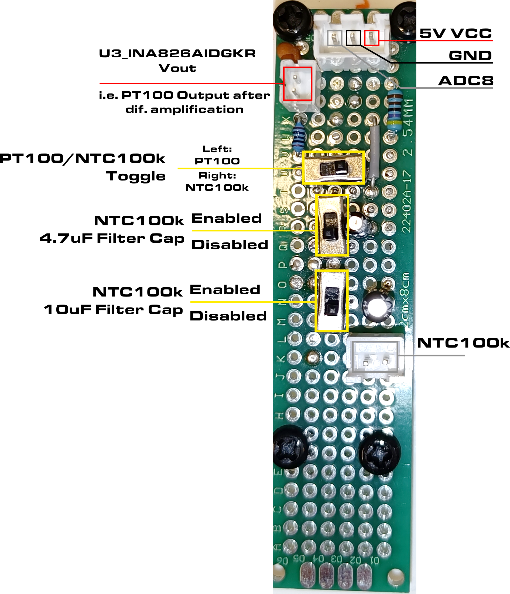
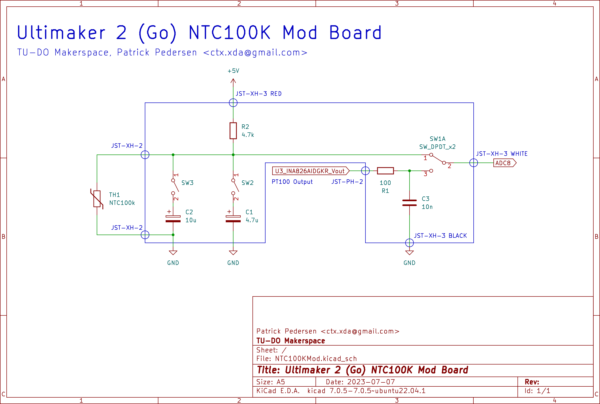
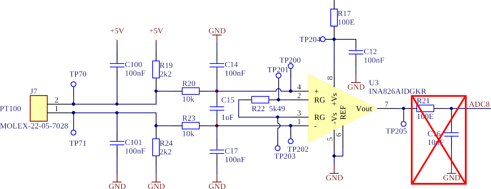
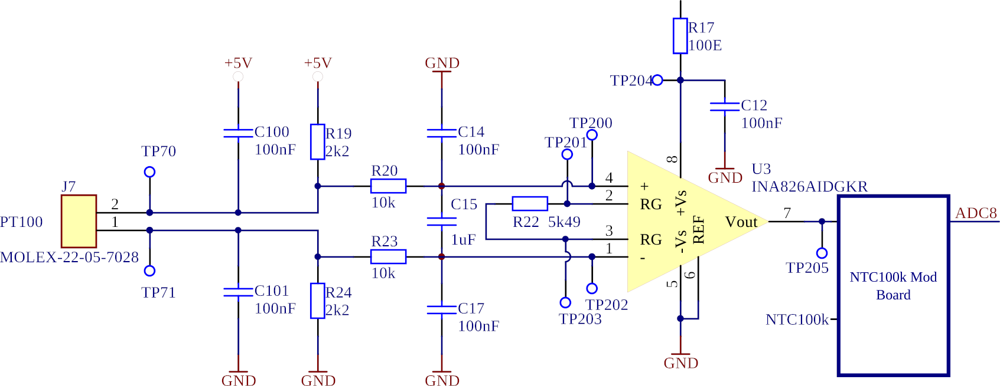

# NTC100K Mod for our Ultimaker 2 Go

After the old PT100 sensor has given up its spirit in our Ultimaker 2 Go, we decided to replace it with the much more
available and cheaper NTC100K sensor. Unfortunately the NTC100k cannot be connected in place of the PT100, because the
PT100 is connected to an OP-AMP for signal amplification before it is fed into the ADC of the ATMega2560.

The NTC100K on the other hand only requires a 4.7kOhm pullup resistor to VCC and can be read directly by the ADC.

Due to these differences, the mainboard has been modified and extended with a small perfboard that allows to
switch between the PT100 and the NTC100K sensor. **Note that Marlin must also be configured according to which
sensor is selected.**

Please be cautious when disconnecting the wires attached to the perfboard, as the JST connectors require a bit of
force to be pulled out which can inevitably lead to the subtle solder joints on the mainboard getting ripped off (hence
all of the hot glue on the mainboard). Unfortunately, this is exactly what happened to me on my first hack job which ended up
ripping out the pads for R21 and C16 on the mainboard... The wires are now soldered to a via and directly the the PT100
op amp output. The missing components have been made up for on the perfboard. 

In hindsight, the modification could be done much cleaner as the Ultimaker board exposes unused ADC pins that could have been
used to read a NTC100K sensor. All that'd then be required is to change the firmware to read the appropriate ADC pin and to
use the correct temp sensor type... oh well, you're always wiser afterwards...

## Mod

Here's an overview of the modboard:




Enabling the caps will filter/average out the signal at the expense of a slower response time. The mod board
offers a 10uF cap and a 4.7uF cap. Both enabled will provide in a total capacitance of 14.7uF. If the temperature
appears to be too noisy or unstable, consider increasing the capacitance.

The following components have been removed from the mainboard:



With the modboard installed, things look like this:



## Firmware

To select the correct sensor, change the following line in `Configuration.h` of Marlin:

```cpp
#define TEMP_SENSOR_0 XX
```

where `XX` is either `20` for the PT100 or `5` for the NTC100K.

## Final Words

I appologize to anyones eyes that had to witness this hack job. I have had to fix this printer way too many times so I got a little impatient
with the fix. I am hoping that this documentation will clarify this cursed mess.

Should you have ripped off the remaining pads that are currently used for the hack, I suggest to drop the modboard completely and use the
one of the remaining two unused temp sensor inputs on the mainboard for the PT100 and use the free ADC pins (exposes by the headers on the left side
of the mainboard) or the "analog input" (to the right of the sensor 1 input. Please measure which pin is VCC and GND!) for the NTC100K (note a 4.7k pull-up has to be added!). This would be a much cleaner solution and would not require any soldering on the mainboard itself. In the firmware, you'd then have to change the temp sensor type and the ADC pin (in `pins.h`) to the one you've connected the NTC100K to.

If you got any questions, feel free to write me a email: `ctx.xda@gmail.com`.